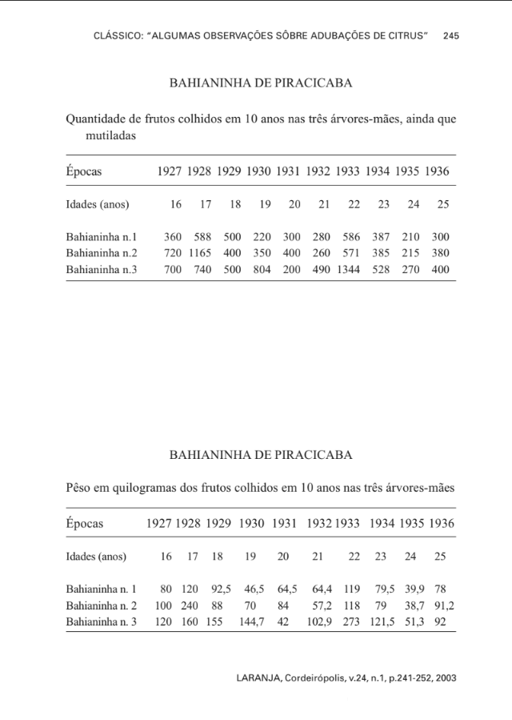

# Teste D — Chunking de Tabelas: Formato Tabular vs. Texto Natural

Experimento local para o pipeline de ingestão **SB100 "Agrônomo Virtual"** (Squad 02 — FAPESP).  
Compara duas estratégias de representação de tabelas em chunks vetorizáveis, usando os mesmos modelos do pipeline v2 em produção.

---

## Contexto

O pipeline v2 de ingestão de PDFs usa **Docling** para extração de texto e tabelas, e detecta automaticamente chunks tabulares pela presença de linhas `| ... |` (campo `tipo: "tabela"` em `montar_payload()`). Este experimento avalia se manter o formato Markdown original ou converter cada linha em texto natural produz melhor recuperação semântica em um sistema RAG híbrido.

**PDF analisado:** `Classico(2003) - Janaina Lais Pacheco Lara Morandin.pdf` — página 5 (2 tabelas).

---

---
## Estratégias Comparadas

### A — Tabular (Markdown)

Um único chunk por tabela, preservando a estrutura original:

```
| Épocas         | 1927 | 1928 | 1929 | 1930 | 1931 | 1932 | 1933 | 1934 | 1935 | 1936 |
| -------------- | ---- | ---- | ---- | ---- | ---- | ---- | ---- | ---- | ---- | ---- |
| Idades (anos)  | 16   | 17   | 18   | 19   | 20   | 21   | 22   | 23   | 24   | 25   |
| Bahianinha n.1 | 360  | 588  | 500  | 220  | 300  | 280  | 586  | 387  | 210  | 300  |
| Bahianinha n.2 | 720  | 1165 | 400  | 350  | 400  | 260  | 571  | 385  | 215  | 380  |
| Bahianinha n.3 | 700  | 740  | 500  | 804  | 200  | 490  | 1344 | 528  | 270  | 400  |
```

**1 chunk por tabela** · 533–563 chars cada.

### B — Texto Natural (por linha)

Cada linha de dados vira um chunk independente com o cabeçalho embutido:

```
Épocas: Bahianinha n.1 | 1927: 360 | 1928: 588 | 1929: 500 | 1930: 220 | 1931: 300 | 1932: 280 | 1933: 586 | 1934: 387 | 1935: 210 | 1936: 300
Épocas: Bahianinha n.2 | 1927: 720 | 1928: 1165 | 1929: 400 | 1930: 350 | 1931: 400 | 1932: 260 | 1933: 571 | 1934: 385 | 1935: 215 | 1936: 380
Épocas: Bahianinha n.3 | 1927: 700 | 1928: 740 | 1929: 500 | 1930: 804 | 1931: 200 | 1932: 490 | 1933: 1344 | 1934: 528 | 1935: 270 | 1936: 400
```

**N chunks por tabela** (1 por linha de dados) · 132–145 chars cada.

---

## Stack Técnico

Idêntico ao pipeline v2 em produção — sem dependências extras.

| Componente | Ferramenta |
|---|---|
| Extração de tabelas | Docling (`TableItem.data.grid`) + Tesseract OCR (`force_full_page_ocr=True`) |
| Embedding denso | `Qwen/Qwen3-Embedding-0.6B` via `sentence-transformers` |
| Embedding esparso | `opensearch-neural-sparse-encoding-doc-v2-distill` (SPLADE) via `transformers` |
| Busca local | FAISS `IndexFlatIP` (cosine) para denso; dot product manual para esparso |
| Ambiente | Google Colab + Google Drive |

---

## Resultados

### Tabelas Extraídas (página 5)

Ambas as tabelas registram dados de **3 árvores-mães de Bahianinha** ao longo de 10 anos (1927–1936, idades 16–25 anos):

- **Tabela 1** — quantidade de frutos colhidos (unidades)
- **Tabela 2** — peso em kg dos frutos colhidos

### Scores de Recuperação

Queries testadas com terminologia do próprio artigo:

| Query | Dense Tab | Dense Text | Sparse Tab | Sparse Text | Vencedor Dense | Vencedor Sparse |
|---|---|---|---|---|---|---|
| Quantidade de frutos colhidos em 10 anos nas três árvores-mães | 0.3764 | 0.3407 | 8.5265 | **13.7279** | Tabular | **Texto Natural** |
| Pêso em quilogramas dos frutos colhidos em 10 anos | 0.3415 | 0.2995 | 7.3005 | **10.7287** | Tabular | **Texto Natural** |

### Placar Geral

| Modelo | Tabular | Texto Natural | Delta médio |
|---|---|---|---|
| Dense (Qwen3) | **2/2** vitórias | 0/2 | ~0.039 (margem mínima) |
| Sparse (SPLADE) | 0/2 | **2/2** vitórias | ~4.31 (margem expressiva) |

---

## Conclusão

**Em busca híbrida (denso + esparso), Texto Natural vence.**

O modelo denso (Qwen3) prefere o chunk tabular por margem mínima (~4%) — provavelmente porque o Markdown concentra todos os dados da tabela em um único vetor. O modelo esparso (SPLADE), porém, prefere o texto natural com margem muito maior (3.4–5.2 pontos), pois trabalha por correspondência de tokens e o Markdown dilui o sinal com caracteres estruturais (`|`, `---`, espaços de padding) que não carregam semântica.

Como o Qdrant no pipeline v2 usa busca híbrida com ambos os vetores, **o sinal esparso domina na prática**.

### Implementação Recomendada para o Qdrant

Vetorizar com **Texto Natural** (melhor similarity híbrida) e armazenar o **Markdown completo no payload** como contexto para o LLM:

```python
# Adaptar montar_payload() — um upsert por linha da tabela
payload = {
    "content":         chunk_texto_natural,   # campo vetorizado (denso + esparso)
    "tabela_markdown": markdown_completo,      # contexto para geração da resposta
    "tipo":            "tabela",
    "pagina_pdf":      pagina,
    "file":            filename,
    "titulo":          artigo.get("Título", ""),
    # ... demais campos de montar_payload() ...
}
```

**Regra prática:** tabelas com ≤ 5 linhas podem usar o chunk tabular inteiro sem perda significativa. Tabelas maiores se beneficiam claramente da granularidade do texto natural.

---

## Limitação Conhecida — Merge de Colunas (Tabela 2)

O OCR fundiu as colunas de 1932 e 1933 em um único cabeçalho `"19321933"`, deixando a coluna seguinte sem rótulo. Isso é um artefato de layout: as colunas estavam próximas demais no PDF original e o Tesseract as leu como uma célula só.

```
# Aparece nos chunks:
"19321933: 644 | : 119"   # deveria ser "1932: 644 | 1933: 119"
```

**Solução sugerida para produção:** pós-processar o grid do Docling com regex antes de gerar os chunks:

```python
import re

def corrigir_cabecalhos_fundidos(header: list) -> list:
    corrigido = []
    for col in header:
        # Detecta dois anos colados: "19321933" → ["1932", "1933"]
        match = re.fullmatch(r'(\d{4})(\d{4})', col.strip())
        if match:
            corrigido.extend([match.group(1), match.group(2)])
        else:
            corrigido.append(col)
    return corrigido
```

---

## Estrutura do Repositório

```
├── table_chunking_comparison.ipynb   # notebook principal
├── table_chunking_results.json       # resultados gerados pelo notebook
└── README.md                         # este arquivo
```

---

## Como Executar

1. Abrir `table_chunking_comparison.ipynb` no Google Colab
2. Montar o Google Drive com o PDF em `Pdfextractor/data/PDFs não vetorizados/`
3. Executar todas as células em ordem
4. **Antes da seção 10**, adaptar as queries ao conteúdo real das tabelas visualizadas na seção 4
5. Os resultados são exportados automaticamente para `Pdfextractor/data/table_chunking_results.json`

---

## Relação com o Pipeline v2

Este experimento é um teste local isolado — não grava no Qdrant Cloud. Seu propósito é validar a estratégia de chunking antes de implementar em `chunk_blocos()` e `montar_payload()` do pipeline principal.

| Componente do pipeline v2 | Impacto deste teste |
|---|---|
| `converter_pdf_bytes()` | Reutilizado diretamente (padrão bytes + tempfile) |
| `chunk_blocos()` | Candidato a receber lógica de texto natural para tabelas |
| `montar_payload()` | Candidato a receber campo `tabela_markdown` extra |
| Coleção `sb100` no Qdrant | Não alterada neste teste |

---

*Squad 02 — Ingestão e Vetorização · Projeto SB100 "Agrônomo Virtual" · FAPESP Iniciação Científica*
